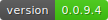

# flarchitect

[](https://github.com/lewis-morris/flarchitect/actions/workflows/docs.yml)
[](https://github.com/lewis-morris/flarchitect/actions/workflows/run-unit-tests.yml)




flarchitect is a friendly Flask extension that turns your SQLAlchemy or Flask-SQLAlchemy models into a production-ready REST API with almost no boilerplate. It automatically builds CRUD endpoints, generates interactive Redoc documentation and keeps responses consistent so you can focus on your application logic.

## Why flarchitect?

If you're new here, welcome! flarchitect gets you from data models to a fully fledged REST API in minutes, letting you focus on the features that matter rather than plumbing.

## Features

- **Zero-configuration endpoints** – expose models as RESTful resources by adding a simple `Meta` class.
- **Automatic documentation** – comprehensive Redoc or Swagger UI docs are generated at runtime and stay in sync with your models.
- **SQLAlchemy integration** – works with plain SQLAlchemy or Flask-SQLAlchemy.
- **Built-in authentication** – ship with JWT, basic and API key strategies out of the box, each exposing a simple `/auth/login` endpoint for credential validation, or plug in your own authentication.
- **Rate limiting & structured responses** – configurable throttling and responses with a consistent schema.
- **Highly configurable** – tweak behaviour globally via Flask config or per model with `Meta` attributes.
- **Field validation** – built-in validators for emails, URLs, IPs and more.
- **Nested writes** – opt-in support for sending related objects in POST/PUT payloads. Enable with `API_ALLOW_NESTED_WRITES = True` and let `AutoSchema` deserialize them automatically.
- **CORS support** – enable cross-origin requests with `API_ENABLE_CORS`. See the [advanced configuration guide](docs/source/advanced_configuration.rst#cors) for an example.
- **Soft delete** – hide and restore records without permanently removing them.
- **Extensible callbacks** – hook into request/response flows to customise behaviour.

## Installation

flarchitect supports Python 3.10 and newer. Set up a virtual environment, install the package and verify the install:

```bash
python -m venv venv
source venv/bin/activate  # On Windows use: venv\Scripts\activate
pip install flarchitect
python -c "import flarchitect; print(flarchitect.__version__)"
```

The final command prints the version number to confirm everything installed correctly.

## Quick Start

```python
from flask import Flask
from flarchitect import Architect
from models import Author, BaseModel  # your SQLAlchemy models

app = Flask(__name__)
app.config["API_TITLE"] = "My API"
app.config["API_VERSION"] = "1.0"
app.config["API_BASE_MODEL"] = BaseModel
app.config["API_ALLOW_NESTED_WRITES"] = True

architect = Architect(app)

if __name__ == "__main__":
    app.run(debug=True)
```

With the application running, try your new API in another terminal window:

```bash
curl http://localhost:5000/api/authors
```

## OpenAPI specification

An OpenAPI 3 schema is generated automatically and powers the Redoc UI. You
can switch to Swagger‑UI by setting ``API_DOCS_STYLE = 'swagger'`` in your Flask
config. Either way you can serve the raw specification to integrate with
tooling such as Postman:

```python
from flask import Flask
from flarchitect import Architect

app = Flask(__name__)
architect = Architect(app)  # OpenAPI served at /openapi.json
```

The specification endpoint can be customised with ``API_SPEC_ROUTE``. See the
[OpenAPI docs](docs/source/openapi.rst) for exporting or customising the
document.

Read about hiding and restoring records with the [soft delete guide](docs/source/soft_delete.rst).

## Running Tests

To run the test suite locally:

```bash
pytest
```

## Documentation & help

- Browse the [full documentation](https://lewis-morris.github.io/flarchitect/) for tutorials and API reference.
- Explore runnable examples in the [demo](https://github.com/lewis-morris/flarchitect/tree/master/demo) directory, including a [validators example](demo/validators/README.md) showcasing email and URL validation.
=======

- Questions? Join the [GitHub discussions](https://github.com/lewis-morris/flarchitect/discussions) or open an [issue](https://github.com/lewis-morris/flarchitect/issues).
- See the [changelog](CHANGES.rst) for release history.

## Contributing

Contributions are welcome! For major changes, please open an issue first to discuss what you would like to change.

Before submitting a pull request, ensure that linters and tests pass locally:

```bash
ruff --fix .
pytest
```

## License

Distributed under the MIT License. See [LICENCE](LICENCE) for details.

